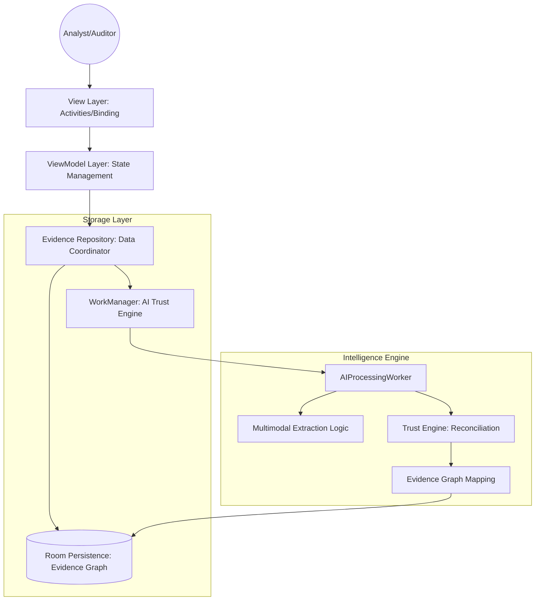
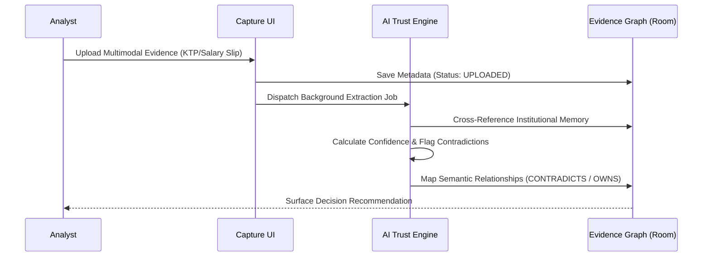

# SaksiAI — Evidence Intelligence Infrastructure

[]()
[]()
[]()
[]()

> **"Every business decision should have a digital witness."**

SaksiAI is an enterprise-grade **Evidence Intelligence Platform (EIP)** designed for the Indonesian regulated landscape (Banking, Insurance, Government). It transforms passive, fragmented records—PDFs, scanned documents, audio recordings, and CCTV feeds—into **trusted, explainable, and decision-ready intelligence.**

---

## 📑 Table of Contents
- [1. Project Overview](#1-project-overview)
- [2. System Architecture](#2-system-architecture)
- [3. Technology Stack](#3-technology-stack)
- [4. Key Features & Business Value](#4-key-features--business-value)
- [5. Project Structure](#5-project-structure)
- [6. Local Development & Setup](#6-getting-started)
- [7. Compliance & Security](#7-compliance--security)
- [8. Operational Best Practices](#8-operational-best-practices)

---

## 1. Project Overview

### Business Problem Statement
Organizations in regulated sectors possess millions of documents and recordings, but this data is **trapped in unusable formats**. Critical evidence (KYC docs, financial slips, CCTV security events) remains fragmented and difficult to search. Organizations lack a unified "Digital Witness" that can verify identities, detect contradictions, and automate the decision-audit path.

### Strategic Objectives
- **Capture Intelligence:** Seamlessly aggregate multimodal data into a unified pipeline.
- **The Trust Engine:** Automate contradiction detection (e.g., mismatched NIK or income records).
- **Institutional Memory:** Build a persistent Knowledge Graph that connects organizational facts over time.
- **Decision Intelligence:** Convert raw unstructured data into verifiable business outcomes.

---

## 2. System Architecture

SaksiAI is built on a strictly decoupled MVVM architecture to ensure data residency compliance and system audibility.

### 🏛 High-Level Architecture

**Component Responsibilities:**
- **View Layer:** Implements specialized capture UIs (Doc OCR/Voice/Video) and visualizations of the Knowledge Network.
- **Evidence Repository:** Acts as the primary mediator between local storage and background intelligence jobs.
- **AI Trust Engine:** A background pipeline that performs semantic extraction and reconciles new data against existing organizational memory.

### 🔄 Decision Data Flow

**Data Interaction:**
- **Input:** Multimodal binary streams (PDF, JPG, MP4, M4A).
- **Processing:** Asynchronous extraction and reconciliation.
- **Output:** Explainable "Reasoning Path" and high-confidence decision recommendations.

---

## 3. Technology Stack

| Category | Technology | Usage |
| :--- | :--- | :--- |
| **Language** |  | Primary language for type-safety and performance (v2.0). |
| **UI Framework** |  | Enterprise Material 3 components. |
| **Persistence** |  | Local-first Evidence Graph & Institutional Memory. |
| **Background** | **WorkManager** | Resilient background processing pipeline for extraction. |
| **Reactive** | **Coroutines & Flow** | Real-time data streaming and asynchronous execution. |
| **Architecture** | **MVVM + Repository** | Scalable, maintainable Clean Architecture approach. |

---

## 4. Key Features & Business Value

- **Multimodal Capture:** Specialized ingestion for Indonesian records (KTP, Slip Gaji) and security video feeds.
- **Trust Engine (Moat):** Automatically flags "Synthetic Identities" or mismatched financial values by traversing the Evidence Graph.
- **Explainable AI:** Every decision includes a logged "Reasoning Path" in the audit trail, fulfilling UU PDP audit requirements.
- **Institutional Memory:** A persistent Knowledge Network that connects People, Companies, and Contracts across capture points.
- **Regulatory Health Index:** Real-time dashboard metrics for PDP Compliance and OJK Audit Coverage.

---

## 5. Project Structure

```text
com.example.saksiai/
├── data/
│   ├── local/
│   │   ├── dao/          # Specialized DAOs (Analytics, Compliance, Graph Traversal)
│   │   ├── entity/       # 14+ Room Entities defining the Evidence Schema
│   │   └── SaksiDatabase # Room Database Configuration (Version 2)
│   ├── repository/       # Unified Data Repository (Decision logic coordinator)
│   └── worker/           # AI Trust Engine Pipeline (AIProcessingWorker)
├── ui/
│   ├── adapter/          # Intelligence Search, Risk, and Relationship adapters
│   └── viewmodel/        # EvidenceViewModel (Analytics & Traversal Logic)
├── MainActivity          # Dashboard (Trust/Risk/Memory metrics)
├── CaptureActivity       # Multimodal Ingestion UI (Layer 1)
├── KnowledgeNetwork      # Evidence Graph Visualization (Layer 4)
└── CaseDetailActivity    # Decision Intelligence & Recommendation Report
```

---

## 6. Getting Started

### Prerequisites
- **Android Studio Ladybug (2024.2.1)** or newer.
- **JDK 11+**
- **Android SDK 35 (Target)** / **24 (Minimum)**.

### Environment Configuration
The project is **Local-First** for data residency compliance. To configure enterprise endpoints, create a `local.properties` file:
```properties
# Enterprise API Configuration (Default is Local Simulation)
API_BASE_URL="https://internal.your-org.co.id/api/v1"
```

### Build & Run
1. **Clone the Repo:** `git clone https://github.com/your-org/SaksiAI.git`
2. **Gradle Sync:** Open the project and let Android Studio download dependencies.
3. **Execution:** Select an emulator (API 34+) and press `Shift + F10`.
4. **Testing:** Run `./gradlew test` for local logic or `./gradlew connectedAndroidTest` for UI.

---

## 7. Compliance & Security (UU PDP)
SaksiAI is architected with **"Compliance by Design"**:
- **Data Residency:** All sensitive Indonesian records remain within the enterprise perimeter by default.
- **Right to be Forgotten:** `viewModel.delete(id)` executes a transactional wipe of all graph nodes associated with an entity.
- **Audit Integrity:** Each extraction path is assigned a unique `transactionHash` for regulatory verification.

---

## 8. Operational Best Practices
- **Case Linking:** Always link verified ID (KTP) and Financial evidence to a **Case** to activate the AI Recommendation Engine.
- **Risk Triage:** Prioritize review tasks where the **Trust Score** is below 80%.
- **Graph Integrity:** Periodically monitor the "Orphaned Entities" metric in the Analytics dashboard to prevent data decay.

---
**License:** Proprietary — Internal Enterprise Use Only.  
**Contact:** SaksiAI Developer Team / Internal IT Support.
